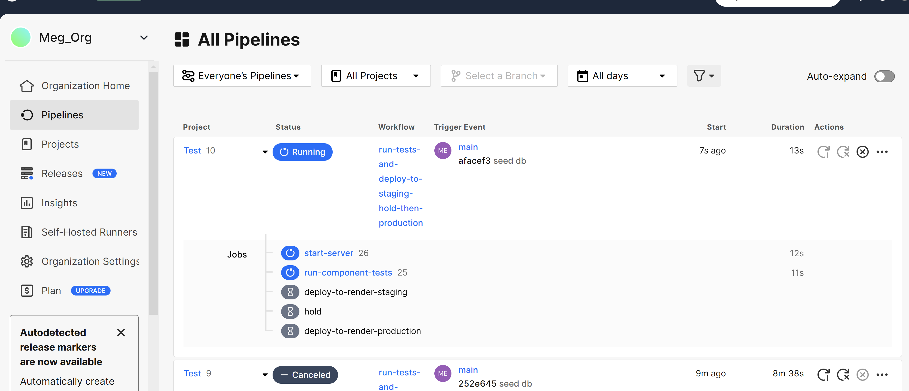
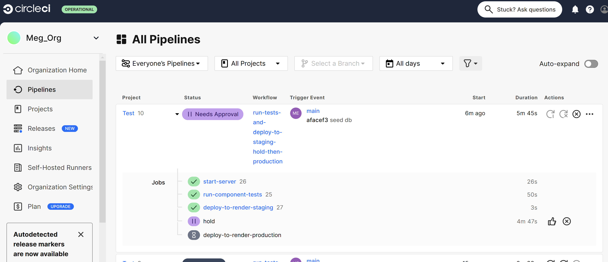

# Learning CircleCI

Creating a CI/CD pipeline with GitHub, CircleCI and Render using Vitest and Cypress for component testing. One web service on Render serves for staging and one for production. 

